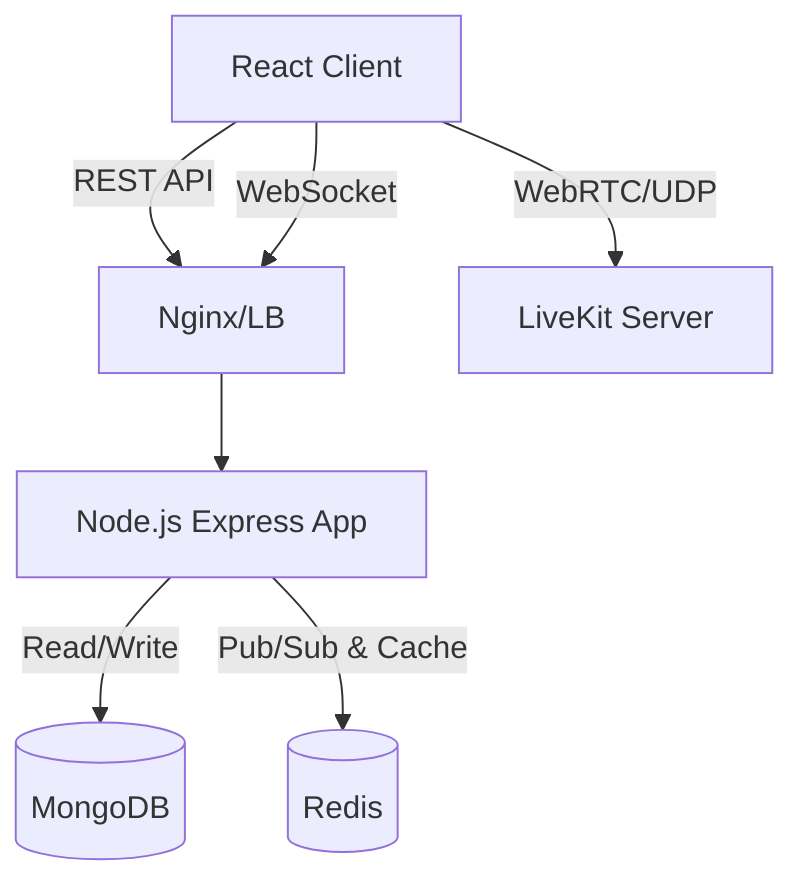

<div align="center">
  

  <h1 align="center">IT4409 Meeting Platform</h1>

  <p align="center">
    Hệ thống Họp trực tuyến Thời gian thực (Real-time Video Conference System)
    <br />
    <a href="#-tài-liệu-api"><strong>Khám phá tài liệu »</strong></a>
    <br />
    <br />
    <a href="#-demo">Xem Demo</a>
    ·
    <a href="#-báo-lỗi">Báo lỗi</a>
    ·
    <a href="#-góp-ý-tính-năng">Góp ý tính năng</a>
  </p>
</div>

<!-- BADGES -->
<div align="center">
  
  
  
  
  
  
</div>

<br />

## 📖 Bảng xếp hạng nội dung (Table of Contents)
<details>
  <summary>Mở rộng để xem chi tiết</summary>
  <ol>
    <li><a href="#-về-dự-án">Về dự án</a></li>
    <li><a href="#-tính-năng-cốt-lõi">Tính năng cốt lõi</a></li>
    <li><a href="#-kiến-trúc-hệ-thống">Kiến trúc hệ thống</a></li>
    <li><a href="#-ngăn-xếp-công-nghệ-tech-stack">Ngăn xếp công nghệ</a></li>
    <li><a href="#-cấu-trúc-mã-nguồn">Cấu trúc mã nguồn</a></li>
    <li><a href="#-hướng-dẫn-cài-đặt">Hướng dẫn cài đặt</a></li>
    <li><a href="#-tài-liệu-api">Tài liệu API & Socket</a></li>
    <li><a href="#-bảo-mật--tối-ưu-hóa">Bảo mật & Tối ưu hóa</a></li>
    <li><a href="#-đóng-góp-contributing">Đóng góp</a></li>
    <li><a href="#-giấy-phép">Giấy phép</a></li>
  </ol>
</details>

## 🚀 Về dự án

**IT4409 Meeting Platform** là một nền tảng họp trực tuyến thời gian thực được xây dựng theo chuẩn Monorepo. Dự án không chỉ dừng lại ở các tính năng đàm thoại video/audio cơ bản mà còn tích hợp các hệ thống nâng cao như quản lý phòng họp, phân quyền, trò chuyện thời gian thực và đặc biệt là hệ thống **Điểm danh bằng Trí tuệ nhân tạo (AI Face Recognition)**.

Dự án được thiết kế theo tiêu chuẩn công nghiệp (Enterprise-grade) với khả năng mở rộng tốt, áp dụng kiến trúc phân lớp (Layered Architecture) ở Backend và quản lý state tập trung ở Frontend.

---

## ✨ Tính năng cốt lõi

- 🔐 **Bảo mật & Xác thực**: OAuth2 (Google Sign-in), JWT với cơ chế Refresh Token tự động, kiểm soát quyền truy cập RBAC (Role-Based Access Control).
- 📹 **Đàm thoại Realtime**: Video/Audio call độ trễ thấp, chia sẻ màn hình (Screen Share), xử lý thông lượng mạng thông minh qua WebRTC và LiveKit.
- 💬 **Trò chuyện trực tuyến**: Chat 1:1, Chat trong phòng họp, hỗ trợ gửi file, thả cảm xúc (Reaction), và xoá tin nhắn.
- 🤖 **AI Face Recognition**: Điểm danh tự động qua nhận diện khuôn mặt (sử dụng MediaPipe), tự động tính toán thời lượng tham gia thực tế của từng thành viên.
- 👑 **Quản trị phòng họp**: Hỗ trợ Waiting Room (Duyệt thành viên), kick, chuyển quyền Host, mã hóa phòng họp.
- 📊 **Admin Dashboard**: Quản lý tổng thể hệ thống, giám sát phòng họp đang hoạt động (Active Meetings), xem Audit Logs.

---

## 🏗 Kiến trúc hệ thống

Dự án sử dụng kiến trúc **Client-Server** kết hợp giao tiếp thời gian thực.



### Luồng xử lý Backend
Kiến trúc Backend tuân thủ nghiêm ngặt mô hình phân lớp (Layered Architecture):
`Request` ➡️ `Joi Validation` ➡️ `Auth/Role Middleware` ➡️ `Controller` ➡️ `Service (Business Logic)` ➡️ `DB/Cache` ➡️ `Response`

---

## 💻 Ngăn xếp công nghệ (Tech Stack)

### 🔹 Frontend Layer
- **Core**: React 19, TypeScript, Vite
- **State Management**: Zustand
- **Routing**: React Router v7
- **UI/Styling**: TailwindCSS v4, Shadcn UI, Base UI
- **Realtime**: Socket.IO Client, LiveKit Components React
- **AI Engine**: Google MediaPipe (Vision Tasks)

### 🔹 Backend Layer
- **Core**: Node.js v18+, Express.js v4
- **Realtime & Media**: Socket.IO v4, LiveKit Server SDK
- **Database**: MongoDB (Mongoose ORM)
- **Cache**: Redis
- **Security & Logging**: bcryptjs, helmet, JWT, Pino, Joi

---

## 📁 Cấu trúc mã nguồn

Dự án áp dụng mô hình **Monorepo**, chia thành 2 sub-projects độc lập.

```text
BTL_IT4409/
├── backend/                   # Khối xử lý nghiệp vụ & API Server
│   ├── src/
│   │   ├── config/            # Cấu hình môi trường, DB, Swagger
│   │   ├── controllers/       # Xử lý HTTP Requests
│   │   ├── middlewares/       # Lọc Request (Auth, Admin, Error)
│   │   ├── models/            # Mongoose Schemas (users, rooms, messages...)
│   │   ├── routes/            # Khai báo RESTful Endpoints
│   │   ├── services/          # Chứa Business Logic cốt lõi
│   │   ├── sockets/           # Xử lý WebSocket Events
│   │   └── utils/             # Helpers (Logger, Constants, Formatters)
│   ├── Dockerfile
│   └── docker-compose.yml
│
└── frontend/                  # Khối giao diện người dùng
    ├── src/
    │   ├── components/        # UI Components dùng chung (Buttons, Dialogs)
    │   ├── hooks/             # Custom React Hooks
    │   ├── screens/           # Các trang giao diện chính (Pages)
    │   ├── services/          # Các hàm gọi API Backend (Axios)
    │   ├── socket/            # Cấu hình Socket.IO Client
    │   ├── stores/            # Zustand Stores quản lý State
    │   ├── types/             # Định nghĩa TypeScript Interfaces
    │   └── utils/             # Helpers
    └── vite.config.ts
```

---

## 🚀 Hướng dẫn cài đặt

### Yêu cầu hệ thống (Prerequisites)
- [Node.js](https://nodejs.org/) v18.0 trở lên.
- [Docker](https://www.docker.com/) & Docker Compose (Dành cho việc chạy nhanh DB/Redis).

### 1. Khởi chạy Backend

```bash
# 1. Di chuyển vào thư mục backend
cd backend

# 2. Cài đặt các gói phụ thuộc
npm install --legacy-peer-deps

# 3. Thiết lập biến môi trường
cp .env.example .env
# (Lưu ý chỉnh sửa các thông số cấu hình trong file .env nếu cần)

# 4. Khởi chạy Database & Redis qua Docker (Khuyên dùng)
docker-compose up -d

# 5. Kiểm tra kết nối và khởi chạy Server
npm run verify
npm run dev
```
> Server sẽ khởi chạy tại: `http://localhost:3000` (Swagger API Docs tại `/api-docs`)

### 2. Khởi chạy Frontend

```bash
# 1. Mở một terminal mới, chuyển vào thư mục frontend
cd frontend

# 2. Cài đặt các gói phụ thuộc
npm install

# 3. Thiết lập biến môi trường
cp .env.example .env

# 4. Khởi chạy giao diện người dùng
npm run dev
```
> Giao diện sẽ khởi chạy tại: `http://localhost:3000` (hoặc cổng được Vite chỉ định).

---

## 🔌 Tài liệu API

Tài liệu API đầy đủ được tự động hóa bằng **Swagger UI**. Sau khi khởi chạy Backend, truy cập:
👉 `http://localhost:3000/api-docs`

**Một số API chính:**
- `POST /api/v1/auth/login` - Đăng nhập
- `POST /api/v1/rooms` - Tạo phòng họp
- `POST /api/v1/rooms/:roomCode/join` - Xin phép tham gia phòng
- `GET /api/v1/history/rooms` - Xem lịch sử họp

**Các Namespaces WebSocket:**
- `/room` - Xử lý tín hiệu vào/ra phòng, kiểm duyệt thành viên, kick.
- `/chat` - Xử lý gửi/nhận tin nhắn realtime.
- `/webrtc` - Signaling cho kết nối P2P (nếu không dùng LiveKit trực tiếp).

---

## 🛡 Bảo mật & Tối ưu hóa

Dự án được thiết kế với tư duy **Security First** và tối ưu hiệu suất tải lớn:

1. **Bảo mật kết nối**: Socket.IO yêu cầu token JWT tại pha kết nối (`auth` payload).
2. **Cơ chế Token**: 
   - `Access Token` ngắn hạn (15 phút) lưu vào Memory.
   - `Refresh Token` lưu trữ an toàn, hỗ trợ cơ chế cấp mới liên tục.
3. **Database Tuning**: Áp dụng Compound Index cho MongoDB tại các queries tra cứu lịch sử, kết hợp TTL Index để tự động xóa Message sau 180 ngày.
4. **Cache State**: Sử dụng Redis để lưu trạng thái kết nối Socket (Socket Mapping) thay vì truy vấn CSDL, đạt tốc độ phản hồi cực nhanh.
5. **Anti-Injection**: Lọc và validate toàn bộ request bằng `Joi`, sử dụng `helmet` bảo vệ HTTP Headers.

---

## 🤝 Đóng góp (Contributing)

Chúng tôi hoan nghênh mọi đóng góp từ cộng đồng để làm cho dự án tốt hơn.

1. Fork dự án
2. Tạo nhánh tính năng (`git checkout -b feature/AmazingFeature`)
3. Commit thay đổi (`git commit -m 'Add some AmazingFeature'`)
4. Push lên nhánh (`git push origin feature/AmazingFeature`)
5. Mở Pull Request

---

## 📄 Giấy phép

Dự án được phân phối dưới giấy phép **MIT License**. Xem `LICENSE` để biết thêm thông tin chi tiết.

---

<div align="center">
  <b>Được phát triển với ❤️ bởi Nhóm Meeting IT4409</b>
</div>
